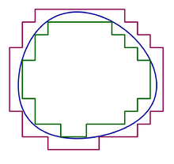
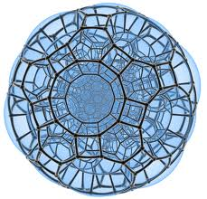
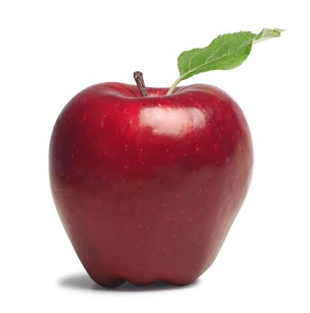
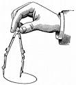
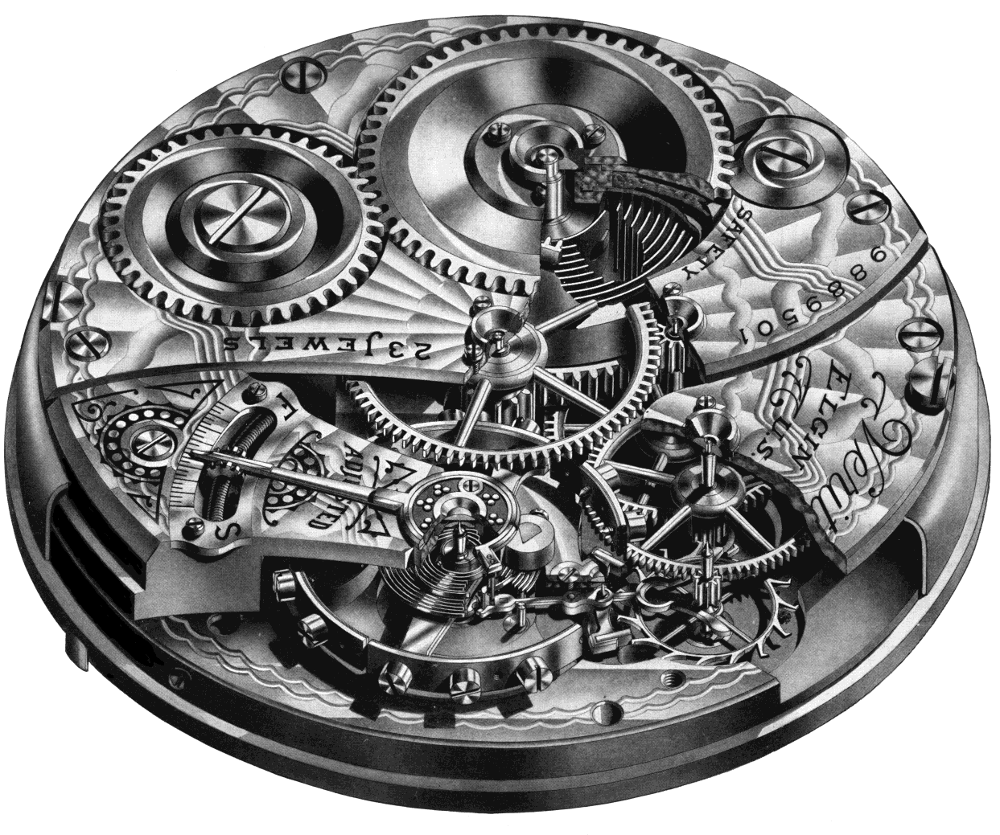
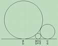
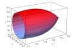
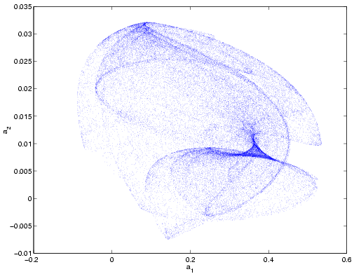
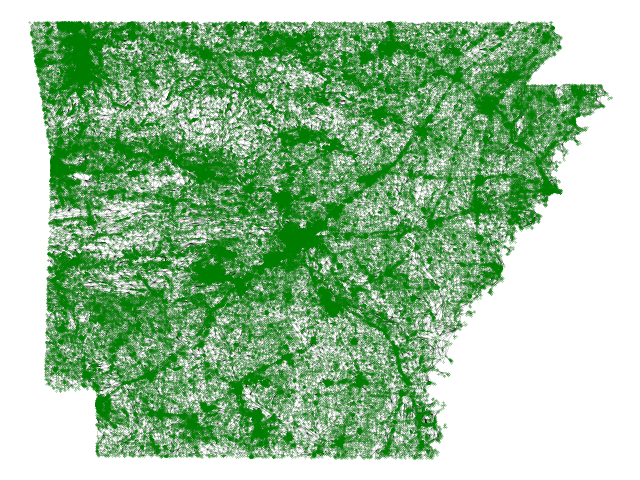

## Teaching

### Current and Recent Courses

* Math 145, Abstract Algebra [[web](https://sites.tufts.edu/algebra/)]
* STS 10, Reading Lab: Math Models in Social Context [[web](http://sites.tufts.edu/models/)]
* Math 250, Geometric Literacy
	* <i>Topics have included: hyperbolic geometry, complex of curves, p-adics, nilpotent geometry,
	Gauss circle theorem, convex geometry, Lie groups</i>
* Math 19, Math of Social Choice [[web](http://sites.tufts.edu/socialchoice/)]
* Math 61, Discrete Math [[web](http://sites.tufts.edu/discretemath/)]
* Math 211, Graduate Real Analysis [[web](courses/math211)]
* Math 112, History of Math [[web](http://sites.tufts.edu/histmath/), [[poster](docs/HistMathPoster.pdf)]
* Math 250, Teichmüller Theory (geometry of surfaces)
* Math 158, Complex Variables [[web](courses/math158/)]
* Math 32-34,  Calc I [[web](courses/math11/)], Calc II [[web](courses/math34/)]

Plus longer ago:  Math for Elementary School Teachers, Differential Geometry, Graduate Topics: Fuchsian Groups,
Linear Algebra with Proofs, etc.

### Other
* Some of my talks
	* Public lecture on gerrymandering at Stanford (youtube)
	* "Rationality and growth" lectures at IAS (videos)
	* "The curve complex and its relatives" ([video](http://www.msri.org/web/msri/online-videos/-/video/showStream/12504/popup)), an expository lecture targeted for advanced graduate students from August 2007.
* Summer math programs you might want to visit
	* I'm a huge fan of [Canada/USA Mathcamp](http://www.mathcamp.org/) for high school students, where I used to visit and teach every summer before I started running my own summer programs more regularly.  It has spun off the truly excellent 
[Bridge to Enter Advanced Mathematics](http://beamath.org/) program, which is focused on cultivating talent in younger
kids in New York and L.A.  These programs are really worthy of your support!
* Super old teaching evals, for some reason
	* Archived teaching evaluation pages from the University of Chicago ([Topics](https://web.archive.org/web/20060710002701/http://www.math.uchicago.edu/~mduchin/evals/112.htm) / [Calc I](https://web.archive.org/web/20060715195655/http://www.math.uchicago.edu/~mduchin/evals/151.htm) / [Calc II](https://web.archive.org/web/20060703164626/http://www.math.uchicago.edu/~mduchin/evals/152.htm))

